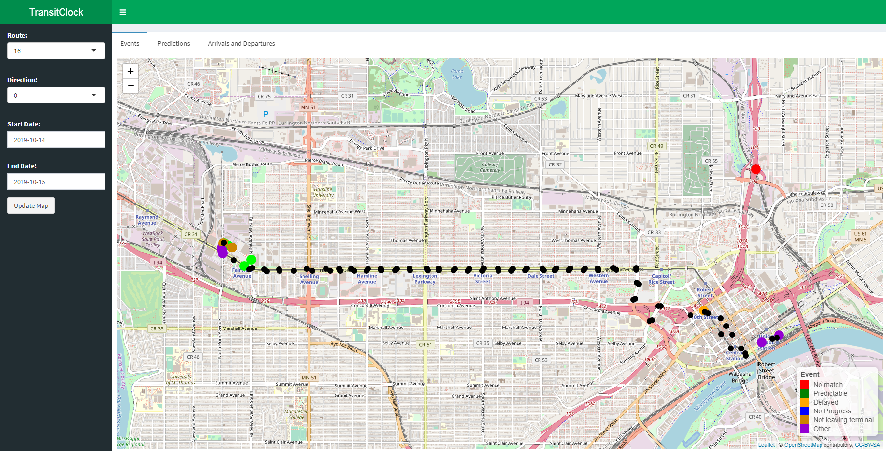
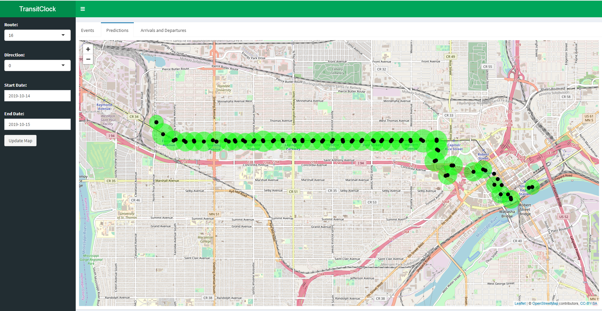
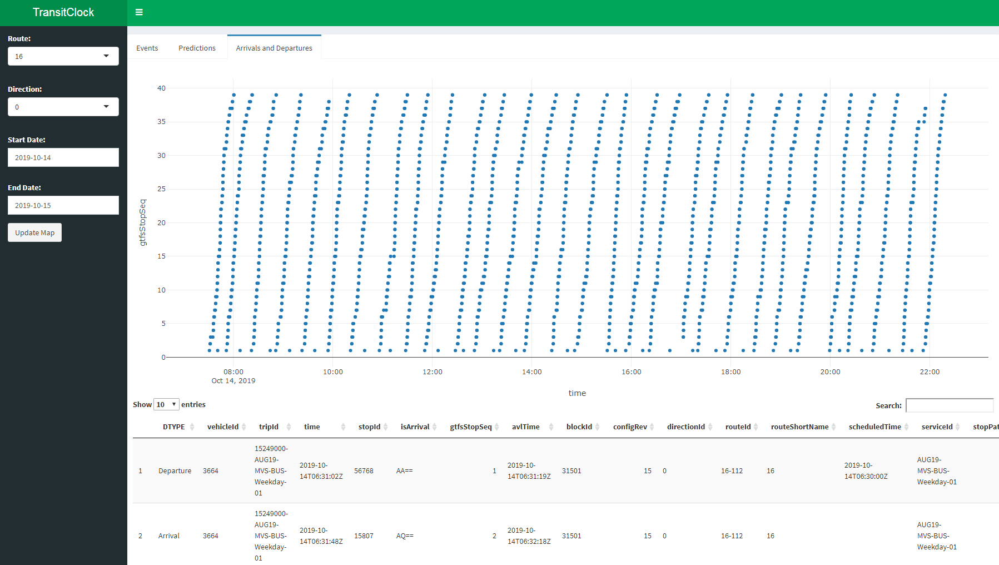
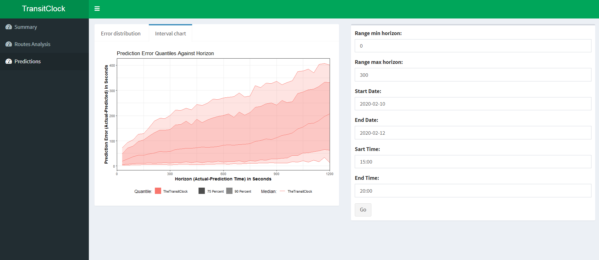

# RShinyTransitClock
A prototype RShiny application to visualize some of the data in TheTransitClock database. Below are some screenshots.
## Events ##
This page shows the vehicle events that have happened on the route. 

## Prediction Accuracy by Stop ##
This page shows the quality of the predictions by stop. The smaller the circle on a stop the better the prediction quality.

## Arrivals and Departures ##
This shows the arrivals and departures on a graph. Time is on the horizontal axis and GTFS stop seqeunce is on the vertical axis.

## Predicton Accuracy
This page is an intercal chart which gives a view of prediction quality.

